# Maptime AMS #7: Mapping the Nieuwmarkt

It's easy to make beautiful interactive web maps with [Mapbox Studio](https://www.mapbox.com/mapbox-studio/), [Leaflet](http://leafletjs.com/) or [D3.js](https://github.com/mbostock/d3/wiki/Gallery#maps). But if you're designing a map for print, and you want full control over the map design and label placement, there's no way around using GIS software and vector editing software. In the [seventh edition](http://www.meetup.com/Maptime-AMS/events/220184224/) of [Maptime Amsterdam](http://maptime-ams.github.io/), we will use [QGIS](http://www.qgis.org/en/site/) (a free and open source geographic information system) and [Inkscape](https://inkscape.org/en/) or [Illustrator](http://www.adobe.com/products/illustrator.html) to design a map of how the Nieuwmarkt looked just before the construction of [Amsterdam's first subway line](http://en.wikipedia.org/wiki/Nieuwmarkt_Riots).

We will use data and information from the following sources:

- Stories told by Ceel Holtkamp during the walking tour,
- Slides from Actiegroep Nieuwmarkt's archive,
- [Amsterdam OpenStreetMap data](https://mapzen.com/metro-extracts/)

And we will design a map showing the construction of the subway:

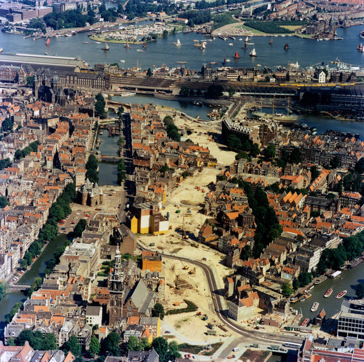

## OpenStreetMap

Today, we'll use OpenStreetMap data as our main data source. It's easiest to use [Mapzen's Metro Extracts](https://mapzen.com/metro-extracts/) to download OSM data for the Amsterdam metropolitan region. You can download raw OSM XML files and process those yourself, or just download the [OSM2PGSQL Shapefile](https://s3.amazonaws.com/metro-extracts.mapzen.com/amsterdam_netherlands.osm2pgsql-shapefiles.zip). Alternatively, you could use [Overpass Turbo](http://overpass-turbo.eu/) to do a specific OSM query.

Steps:

1. Go to https://mapzen.com/metro-extracts/
2. Download [Amsterdam OSM2PGSQL Shapefile](https://s3.amazonaws.com/metro-extracts.mapzen.com/amsterdam_netherlands.osm2pgsql-shapefiles.zip)

### Data

The OpenStreetMap ZIP-file contains three Shapefiles (each Shapefile consists of a number of files, e.g. `.shp`, `.dbf`, etc.):

- `amsterdam_netherlands.osm-polygon.shp`
- `amsterdam_netherlands.osm-line.shp`
- `amsterdam_netherlands.osm-point.shp`

The properties of an OpenStreetMap feature are defined by its [keys and tags](http://wiki.openstreetmap.org/wiki/Tags). For example, a line with the `railway=rail` tag means the line is a railroad track, a polygon with the tag `building=yes` means the polygon is a building. You can use the values of these properties to style the elements accordingly. Mapbox Studio does this with [CartoCSS](https://www.mapbox.com/guides/cartocss-in-studio/), but you can also do this in QGIS.

Some examples from the OpenStreetMap wiki:

- http://wiki.openstreetmap.org/wiki/Tag:natural%3Dwater
- http://wiki.openstreetmap.org/wiki/Tag:highway%3Dprimary

To get some insight into what keys and tags OpenStreetMap uses, you can use the query tool:

- https://www.openstreetmap.org/query?lat=52.37461&lon=4.90151

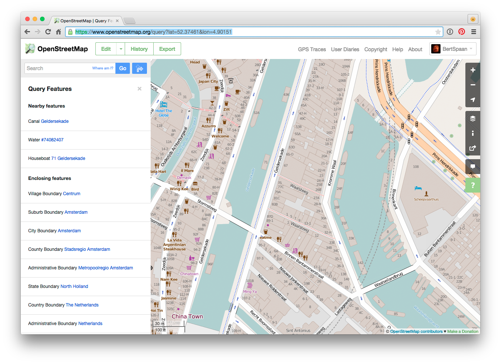

Or, if you have an OSM account, you can use the OpenStreetMap editor:

- https://www.openstreetmap.org/edit#map=18/52.37438/4.90243

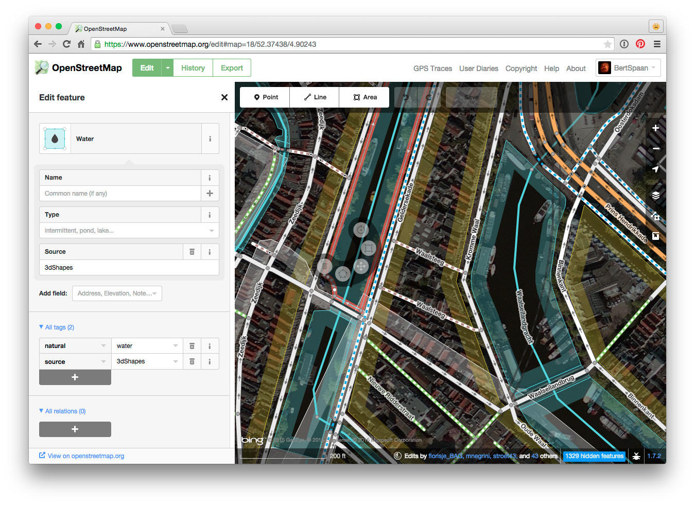

For this tutorial, we will make a simple map of the Nieuwmarkt neighbourhood, and we will only use polygon and line data with the following tags:

Polygons:

- Water - [`water` key](http://wiki.openstreetmap.org/wiki/Key:water)
- Buildings - [`building` key](http://wiki.openstreetmap.org/wiki/Key:building)
- natural - [`natural` key](http://wiki.openstreetmap.org/wiki/Key:natural)

Lines:

- Roads - [`highway` key](http://wiki.openstreetmap.org/wiki/Key:highway)
- Railways - [`railway` key](http://wiki.openstreetmap.org/wiki/Key:railway)
- Waterways - [`waterway` key](http://wiki.openstreetmap.org/wiki/Key:waterway)

## QGIS

It's time to do sime proper GIS! QGIS is open source GIS software, and it's pretty good usually. We will use it do filter, style and project OpenStreetMap data, and to export a selection of the data to PDF.

First, download and install [QGIS](http://www.qgis.org/en/site/) (and all its dependencies). Afterwards, you should be able to open the OSM Shapefiles.

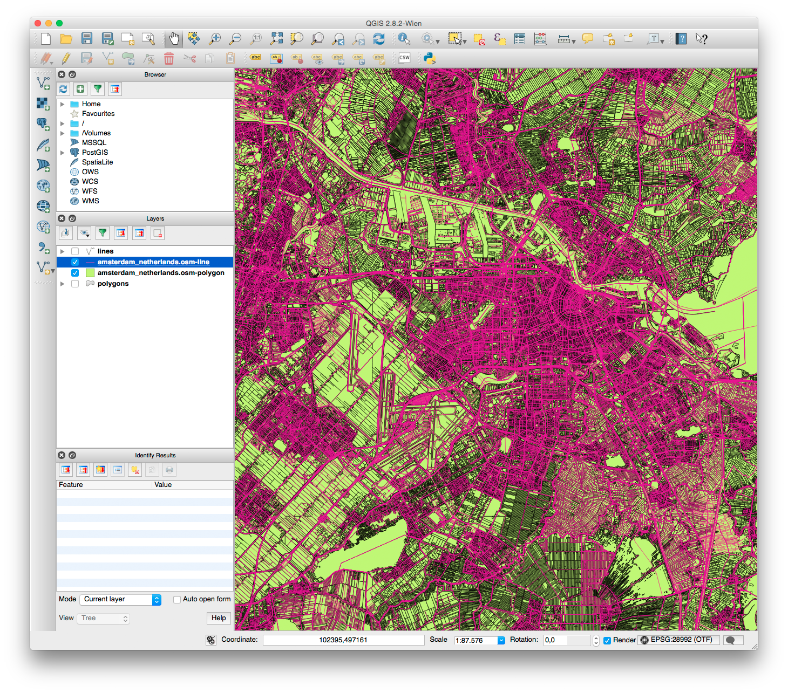

_QGIS and I don't always seem to like each other. And QGIS does not seem to like very large files (`amsterdam_netherlands.osm-polygon.shp` in particular). And QGIS also does not like filenames containing dots. To make your life easier, I already prepared a set of Shapefiles containing just data around the Nieuwmarkt. You can find them in the [`osm`](osm) directory of this tutorial!_

The Amsterdam metropolitan region OSM files contain much more data than just Amsterdam and the files are quite large. (The files contain data of Leiden, Almere and Alkmaar, too.) We only need data around the Nieuwmarktbuurt, and export only a selection of the data. QGIS can do this in a few ways:

- _Select by location_,
- _Open Attribute Table_, and apply some sort of `bbox` filter,
- _Select Feature(s)_, by bounding box. This is the eastiest way to filter the features - just draw a selection rectangle around them.

Steps:

1. Download and [QGIS](http://www.qgis.org/en/site/) and all its dependencies,
2. Open `amsterdam_netherlands.osm-polygon.shp` and `amsterdam_netherlands.osm-line.shp`, look around,
3. Try to do spatial filtering,
4. __Or just use the Shapefiles in the [`osm`](osm) directory of this tutorial! Much easier.__

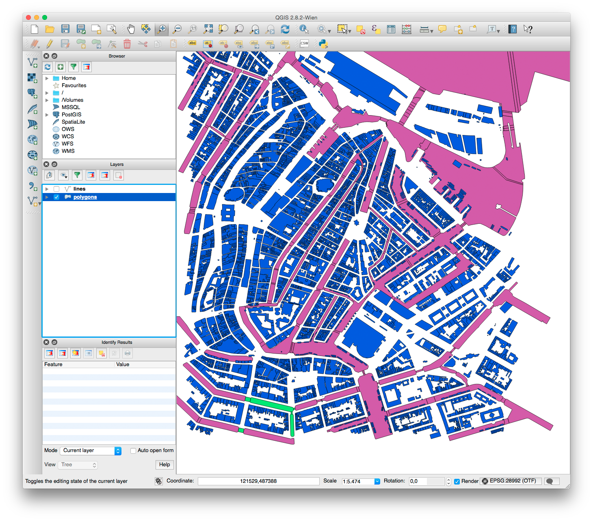

### Filter by OSM key

Right click on a layer in the layers menu, and select _Filter..._. This will open the _Query Builder_, which you can use to filter features by their OpenStreetMap keys and tags.

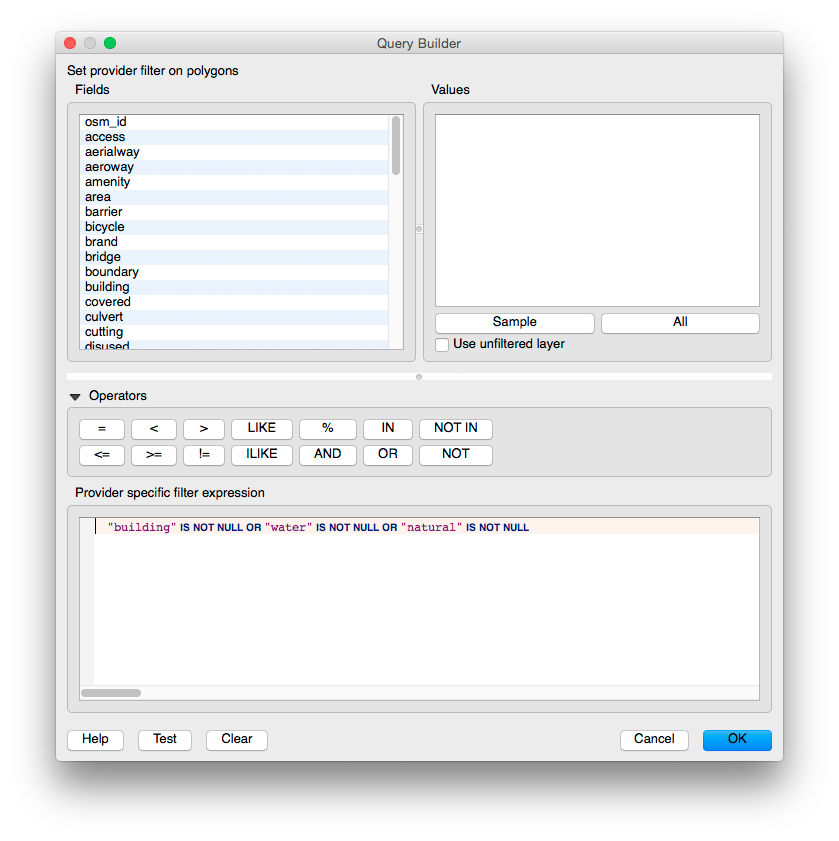

Enter the following expression for the polygons layer:

    "building" IS NOT NULL OR "water" IS NOT NULL OR "natural" IS NOT NULL

And for the lines layer:

    "highway" IS NOT NULL OR railway IS NOT NULL OR "waterway" IS NOT NULL

Now, we're left with just the data we need to make our map!

Steps:

- Filter polygons and lines by bounding box (or use Shapefiles in [`osm`](osm) directory),
- Filter polygons by key, only use features with a non-empty `building`, `water` or `natural` key,
- Filter lines by key, only use features with a non-empty `highway`, `railway` or `waterway` key.

### Style data

QGIS has advanced styling capabilities - see the _Style_ tab in the _Layer Properties_ window. But for small maps with static data (if you don't have to apply the same style to a set of different maps), it's usually much easier to do the final styling in Inkscape or Illustrator. And you'll get better looking maps, too.

However, if you would export the polygons and lines layers without any styling, there will be no way to distinguish roads and railways and water and parks later. Therefor we do need to apply some basic styling (usually random colors will do) for the different values of the OpenStreetMap keys for both layers. We can do this in the _Style_ tab of the _Layer Properties_ window, by setting a custom expression as _Column_. If you click the little expression icon, the _Expression dialog_ will open.

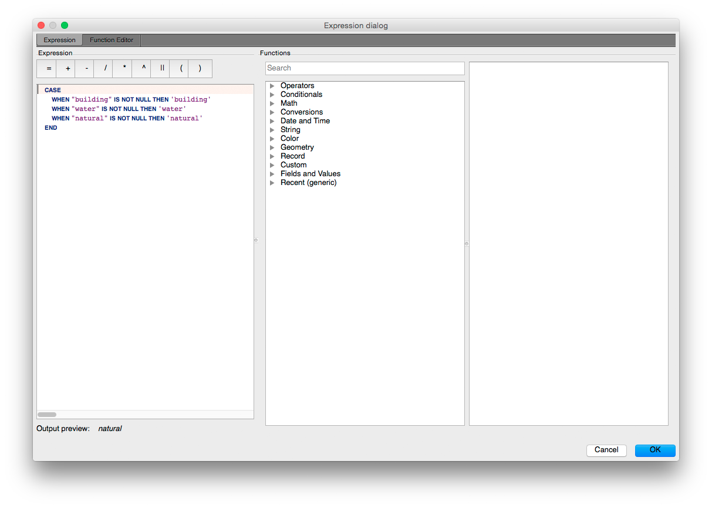

We will use the following expression for the polygon layer:

    CASE
        WHEN "building" IS NOT NULL THEN 'building'
        WHEN "water" IS NOT NULL THEN 'water'
        WHEN "natural" IS NOT NULL THEN 'natural'
    END

And this one for the lines layer:

    COALESCE("highway", "railway", "waterway")

The `COALESCE` function will select the value of the first OSM key which is not NULL.

After entering the expressions, QGIS will compute the different values this expression produces, and we will see these values in a list. We can apply random colors to each of the values by selecting _Random colors_ in the _Color ramp_ drop-down, and clicking _Classify_.

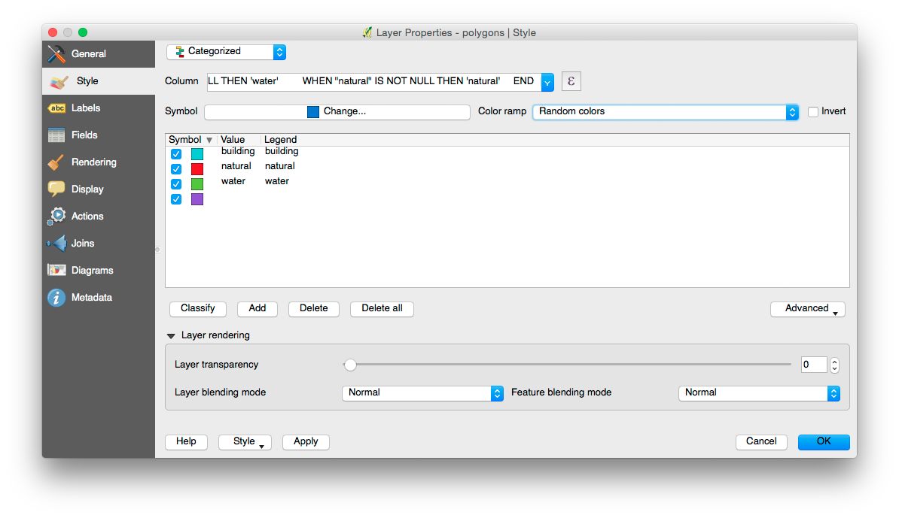

Steps:

- Apply style expression for polygons layer,
- Apply style expression for lines layer.

For more information about making maps with QGIS, see the following tutorials:

- http://www.qgistutorials.com/en/docs/making_a_map.html
- http://qgis.spatialthoughts.com/2012/06/making-maps-for-print-using-qgis.html

### Labels

QGIS also does labels. Our lines layer contains the names of roads and canals in the OSM [`name` key](http://wiki.openstreetmap.org/wiki/Key:name). We can turn on and configure label placement in the _Layer Properties_ window, and select the `name` field as our label expression.

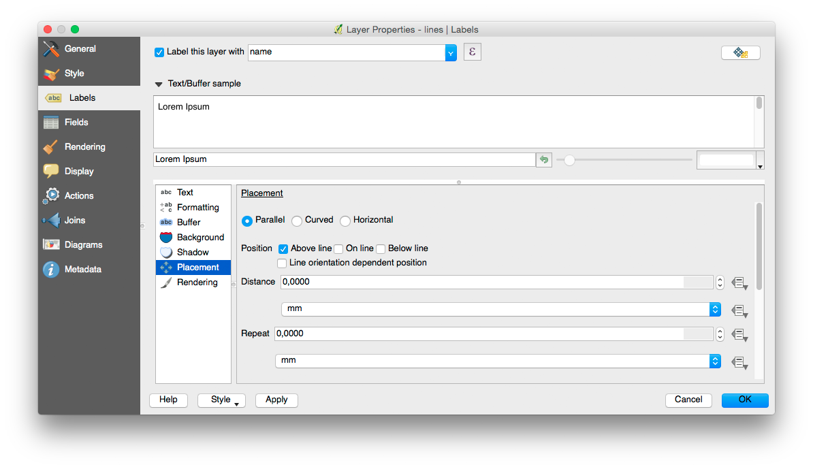

Labeling is difficult to get right, it's easiest just to let QGIS render each label once for each street, and set the fonts, exact placement, shadow, halo and curvature later in Inkscape or Illustrator.

Steps:

- Turn on labels for the lines layer, using the `name` field.

### Export

First, set the correct projecten in the _Project Properties_. Set the projection to _Amersfoort / RD New (EPSG:28992)_.

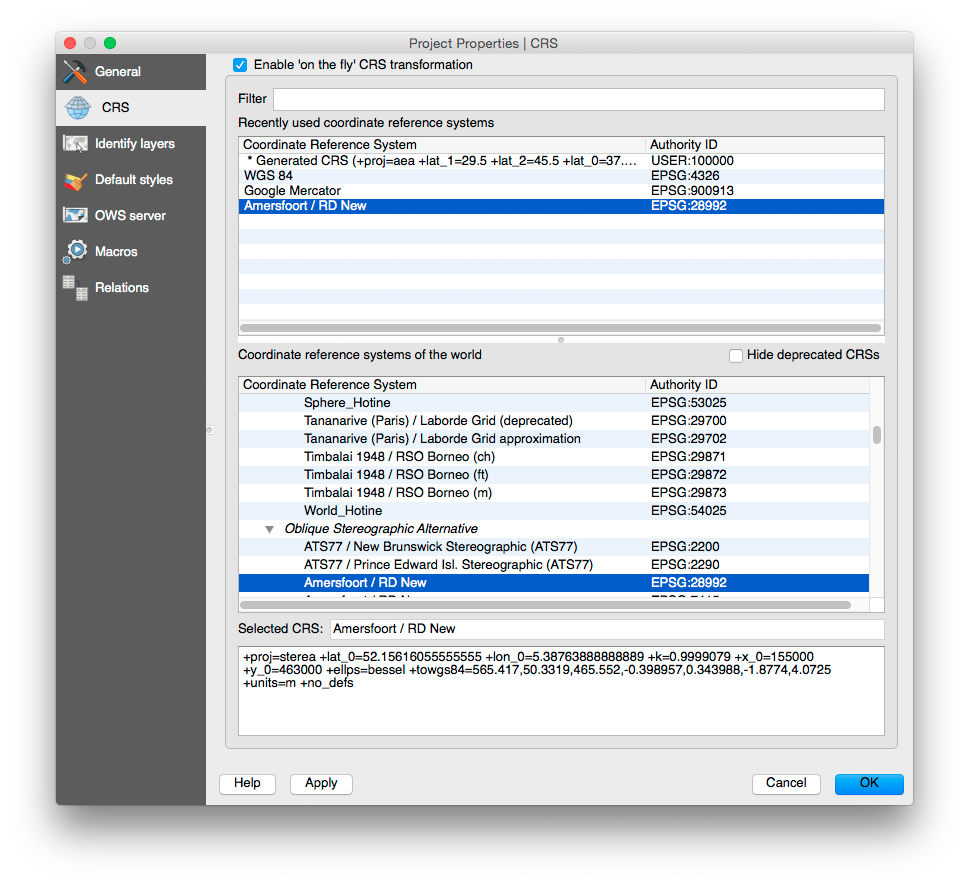

Now we can create a _New Print Composer_, choose a name, and add our map to the newly created Print Composer with _Layout > Add Map_. We can zoom and pan with the _Move item content_ option, if we're happy with how the map looks, choose _Export as PDF_.

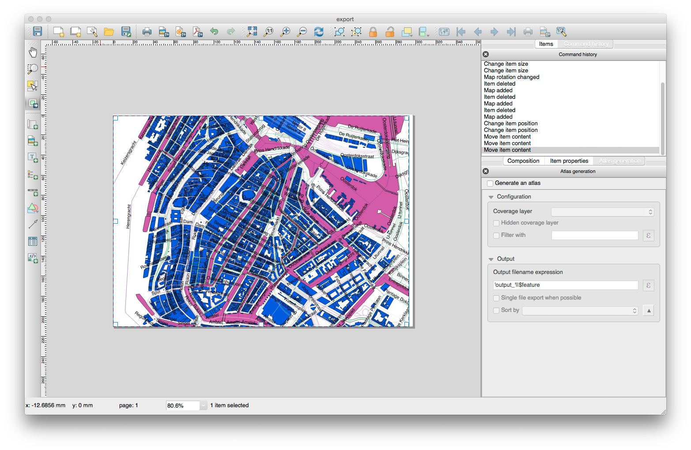

Steps:

- Set map projection to EPSG:28992,
- Create new print composer,
- Add map to print composer,
- Export map as PDF

## Map design

Now we have a PDF containing our map data, and we can use Inkscape, Illustrator, or any other vector editor to open this PDF file and style the map.

It's not easy to create a beautiful map if you have no experience with either Inkscape or Illustrator. But if you use the following techniques, you should get at least somewhere:

- Ungroup and unclip all objects. The PDF exported by QGIS contains grouped features inside clipping masks. This will make editing more difficult, it's best to try to get all the features out of all groups and clipping masks.
- Create new, empty layers for roads, buildings, water, etc.
- __This is most important tool:___ with _Edit > Select Same_ (Inkscape) or _Select > Same_ (Illustrator) you can select objects with the same color or appearance. We have used the style expression in QGIS to give map features of the same type a different color, now we can select those all those features at once. After we have selected them, we can place them in their own layer.
- Water is blue, grass is green, and your map is finished!

Steps:

- Download and install [Inkscape](https://inkscape.org/en/) or the trial version of [Adobe Illustrator](http://www.adobe.com/products/illustrator.html)
- Open the exported PDF
- Style your map!

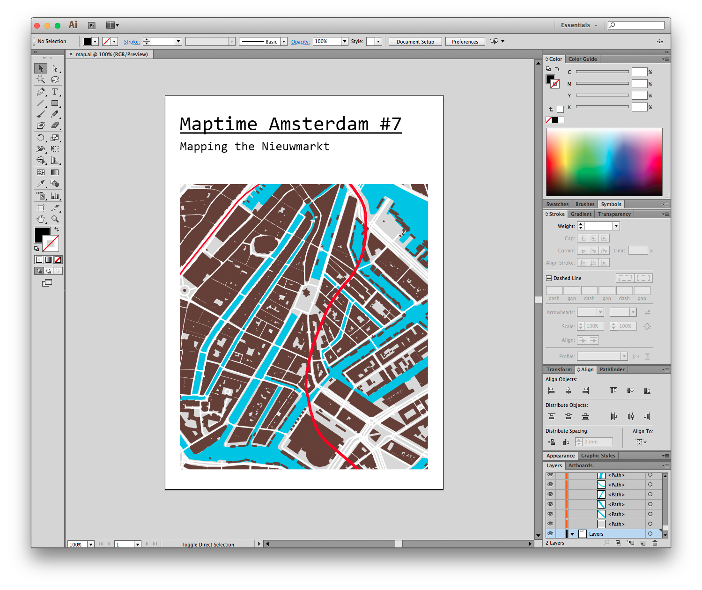
